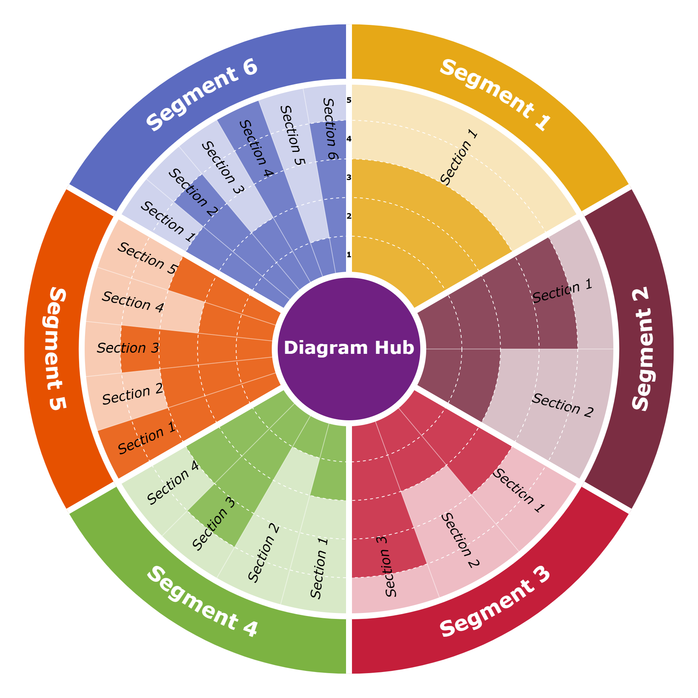

# Radial Diagram Generator

A configurable circular/radial diagram generator that outputs SVG. Useful for maturity models, capability assessments, radar charts, and similar visualizations.

<p align="center">
  
</p>

## Installation

```bash
npm install radial-diagram
```

## Quick Start (Development)

Clone the repository and run the interactive demo:

```bash
git clone https://github.com/andycop/radial-diagram.git
cd radial-diagram
npm install
npm run build
npm run demo
```

Open <http://localhost:3000> (redirects to the demo page).

## Development

```bash
npm run dev    # watches src/, rebuilds on change, and serves demo
npm test       # run unit tests
```

## Configuration

The diagram is configured via JSON. See `demo/configs/example.json` for a complete example.

### Root Options

| Property     | Type   | Description                                     |
| ------------ | ------ | ----------------------------------------------- |
| `size`       | number | Diagram size in pixels (width = height)         |
| `startAngle` | number | Starting angle in degrees (-90 = top)           |
| `center`     | object | Center hub configuration                        |
| `scale`      | object | Score scale configuration                       |
| `segments`   | array  | Outer segments with facets                      |
| `style`      | object | Visual styling options                          |

### Center Hub (`center`)

| Property      | Type    | Default    | Description                                     |
| ------------- | ------- | ---------- | ----------------------------------------------- |
| `label`       | string  |            | Text displayed in center                        |
| `radius`      | number  |            | Hub radius in pixels                            |
| `color`       | string  |            | Fill color (supports alpha, e.g., `#8B3A6280`)  |
| `borderWidth` | number  | 0          | Border stroke width                             |
| `borderColor` | string  | `#ffffff`  | Border stroke color                             |
| `visible`     | boolean | true       | Show/hide the center hub                        |

### Scale (`scale`)

| Property | Type   | Default | Description                  |
| -------- | ------ | ------- | ---------------------------- |
| `min`    | number | 1       | Minimum score value          |
| `max`    | number | 5       | Maximum score value          |
| `rings`  | number | 5       | Number of concentric rings   |

### Segments (`segments[]`)

| Property | Type   | Description                             |
| -------- | ------ | --------------------------------------- |
| `name`   | string | Segment label (displayed on outer ring) |
| `color`  | string | Segment fill color                      |
| `facets` | array  | Facets within this segment              |

### Facets (`segments[].facets[]`)

| Property      | Type   | Description                             |
| ------------- | ------ | --------------------------------------- |
| `name`        | string | Facet label                             |
| `score`       | number | Score value (within scale min-max range)|
| `description` | string | Optional description for tooltips       |

### Style Options (`style`)

#### Rings

| Property    | Type    | Default    | Description                            |
| ----------- | ------- | ---------- | -------------------------------------- |
| `showRings` | boolean | true       | Show concentric ring circles           |
| `ringColor` | string  | `#cccccc`  | Ring circle color                      |
| `ringWidth` | number  | 1          | Ring stroke width                      |
| `ringStyle` | string  | `dashed`   | Ring style: `solid` or `dashed`        |

#### Score Labels

| Property                | Type    | Default    | Description                  |
| ----------------------- | ------- | ---------- | ---------------------------- |
| `showScoreLabels`       | boolean | false      | Show score level labels (1-5)|
| `scoreLabelFontSize`    | number  | 14         | Score label font size        |
| `scoreLabelColor`       | string  | `#ffffff`  | Score label fill color       |
| `scoreLabelStrokeColor` | string  | `#333333`  | Score label outline color    |

#### Facet Points

| Property          | Type    | Default  | Description                               |
| ----------------- | ------- | -------- | ----------------------------------------- |
| `showFacetPoints` | boolean | true     | Show facet indicator points               |
| `facetPointStyle` | string  | `circle` | Point style: `circle`, `dot`, or `none`   |

#### Facets

| Property       | Type   | Default | Description                       |
| -------------- | ------ | ------- | --------------------------------- |
| `facetOpacity` | number | 1       | Opacity of score fill areas (0-1) |
| `facetFontSize`| number | 11      | Facet label font size             |

#### Segment Dividers

| Property              | Type    | Default   | Description                |
| --------------------- | ------- | --------- | -------------------------- |
| `showSegmentDividers` | boolean | true      | Show segment divider lines |
| `segmentDividerWidth` | number  | 2         | Divider line width         |
| `segmentDividerColor` | string  | `#ffffff` | Divider line color         |

#### Hub Text

| Property       | Type   | Default   | Description                  |
| -------------- | ------ | --------- | ---------------------------- |
| `hubFontSize`  | number | 14        | Center hub label font size   |
| `hubFontColor` | string | `#ffffff` | Center hub label color       |

#### Segment Labels

| Property         | Type   | Default | Description             |
| ---------------- | ------ | ------- | ----------------------- |
| `segmentFontSize`| number | 28      | Segment label font size |

#### General

| Property          | Type   | Default             | Description                              |
| ----------------- | ------ | ------------------- | ---------------------------------------- |
| `fontFamily`      | string | `Arial, sans-serif` | Font family for all labels               |
| `backgroundColor` | string |                     | Background color (transparent if not set)|

## Example Configuration

```json
{
  "size": 800,
  "startAngle": -90,
  "center": {
    "label": "Core",
    "radius": 100,
    "color": "#8B3A62",
    "borderWidth": 8,
    "borderColor": "#ffffff",
    "visible": true
  },
  "scale": {
    "min": 1,
    "max": 5,
    "rings": 5
  },
  "segments": [
    {
      "name": "Segment 1",
      "color": "#E6A817",
      "facets": [
        { "name": "Section 1", "score": 3 },
        { "name": "Section 2", "score": 4 }
      ]
    }
  ],
  "style": {
    "fontFamily": "Verdana, sans-serif",
    "showRings": true,
    "ringStyle": "dashed",
    "showScoreLabels": true,
    "facetOpacity": 0.8,
    "segmentDividerWidth": 8
  }
}
```

## Programmatic Usage

```typescript
import { SVGRenderer, DiagramConfig } from 'radial-diagram';

const config: DiagramConfig = {
  // ... your configuration
};

const renderer = new SVGRenderer(config);
const svg = renderer.render();
```

## License

MIT
