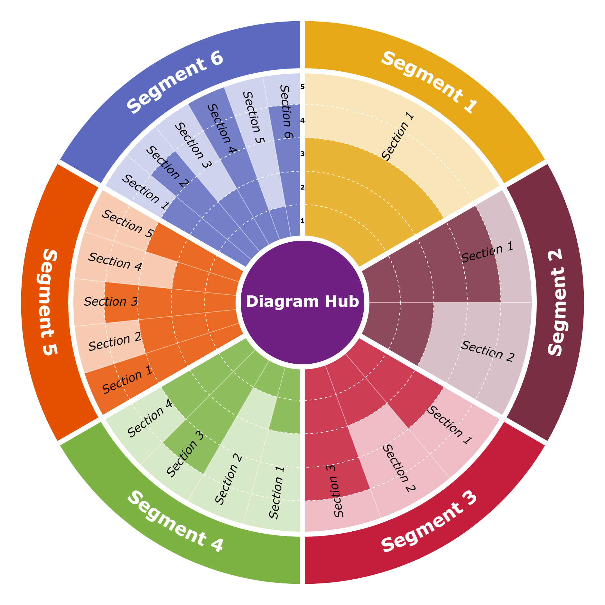

# Radial Diagram Generator

A configurable circular/radial diagram generator that outputs SVG. Useful for maturity models, capability assessments, radar charts, and similar visualizations.

<p align="center">
  
</p>

## Installation

```bash
npm install radial-diagram
```

A Python port lives in [`python/`](python/) for server-side use (e.g. generating PDF reports). It accepts the same JSON config and produces visually identical SVG — see [python/README.md](python/README.md).

## Quick Start (Development)

Clone the repository and run the interactive demo:

```bash
git clone https://github.com/andycop/radial-diagram.git
cd radial-diagram
npm install
npm run build
npm run demo
```

Open <http://localhost:3000> (redirects to the demo page).

## Standalone Version

A self-contained single-file HTML version is available at [`demo/radial-diagram.html`](demo/radial-diagram.html). This file has no dependencies and can be hosted anywhere or opened directly from the filesystem.

The standalone file is auto-generated from the source files. To rebuild after making changes:

```bash
npm run build:standalone
```

This runs automatically as part of `npm run build`.

## Development

```bash
npm run dev    # watches src/, rebuilds on change, and serves demo
npm test       # run unit tests
```

### Cross-language test harness

Each language implementation (TypeScript, Python, …) is held to producing the same image for the same config via a tier-based golden test harness. TypeScript is the canonical implementation; new features get built there first.

```bash
npm run regenerate-goldens                       # rebuild TS goldens + contact sheet
open tests/shared/goldens/contact-sheet.html     # eyeball every tier side by side
cd python && .venv/bin/python -m pytest tests/   # full Python suite incl. equivalence
```

See [tests/shared/README.md](tests/shared/README.md) for the tier ladder and the workflow when adding a new feature.

## Configuration

The diagram is configured via JSON. See `demo/configs/example.json` for a complete example.

### Root Options

| Property     | Type   | Description                                     |
| ------------ | ------ | ----------------------------------------------- |
| `size`       | number | Diagram size in pixels (width = height)         |
| `startAngle` | number | Starting angle in degrees (-90 = top)           |
| `center`     | object | Center hub configuration                        |
| `scale`      | object | Score scale configuration                       |
| `segments`   | array  | Outer segments with facets                      |
| `style`      | object | Visual styling options                          |

### Center Hub (`center`)

| Property      | Type    | Default    | Description                                     |
| ------------- | ------- | ---------- | ----------------------------------------------- |
| `label`       | string  |            | Text displayed in center                        |
| `radius`      | number  |            | Hub radius in pixels                            |
| `color`       | string  |            | Fill color (supports alpha, e.g., `#8B3A6280`)  |
| `borderWidth` | number  | 0          | Border stroke width                             |
| `borderColor` | string  | `#ffffff`  | Border stroke color                             |
| `visible`     | boolean | true       | Show/hide the center hub                        |

### Scale (`scale`)

| Property | Type   | Default | Description                  |
| -------- | ------ | ------- | ---------------------------- |
| `min`    | number | 1       | Minimum score value          |
| `max`    | number | 5       | Maximum score value          |
| `rings`  | number | 5       | Number of concentric rings   |

### Segments (`segments[]`)

| Property     | Type   | Description                                                                          |
| ------------ | ------ | ------------------------------------------------------------------------------------ |
| `name`       | string | Segment label (displayed on outer ring)                                              |
| `color`      | string | Segment fill color                                                                   |
| `labelColor` | string | Optional. Override fill for the dimension label band. Falls back to `color` if unset. |
| `facets`     | array  | Facets within this segment                                                           |

### Facets (`segments[].facets[]`)

| Property      | Type   | Description                             |
| ------------- | ------ | --------------------------------------- |
| `name`        | string | Facet label                             |
| `score`       | number | Score value (within scale min-max range)|
| `description` | string | Optional description for tooltips       |

### Style Options (`style`)

#### Rings

| Property    | Type    | Default    | Description                            |
| ----------- | ------- | ---------- | -------------------------------------- |
| `showRings` | boolean | true       | Show concentric ring circles           |
| `ringColor` | string  | `#cccccc`  | Ring circle color                      |
| `ringWidth` | number  | 1          | Ring stroke width                      |
| `ringStyle` | string  | `dashed`   | Ring style: `solid` or `dashed`        |

#### Score Labels

| Property                | Type    | Default    | Description                  |
| ----------------------- | ------- | ---------- | ---------------------------- |
| `showScoreLabels`       | boolean | false      | Show score level labels (1-5)|
| `scoreLabelFontSize`    | number  | 14         | Score label font size        |
| `scoreLabelColor`       | string  | `#ffffff`  | Score label fill color       |
| `scoreLabelStrokeColor` | string  | `#333333`  | Score label outline color    |

#### Facet Points

| Property          | Type    | Default  | Description                               |
| ----------------- | ------- | -------- | ----------------------------------------- |
| `showFacetPoints` | boolean | true     | Show facet indicator points               |
| `facetPointStyle` | string  | `circle` | Point style: `circle`, `dot`, or `none`   |

#### Facets

| Property       | Type   | Default | Description                       |
| -------------- | ------ | ------- | --------------------------------- |
| `facetOpacity` | number | 1       | Opacity of score fill areas (0-1) |
| `facetFontSize`| number | 11      | Facet label font size             |

#### Segment Dividers

| Property              | Type    | Default   | Description                |
| --------------------- | ------- | --------- | -------------------------- |
| `showSegmentDividers` | boolean | true      | Show segment divider lines |
| `segmentDividerWidth` | number  | 2         | Divider line width         |
| `segmentDividerColor` | string  | `#ffffff` | Divider line color         |

#### Hub Text

| Property       | Type   | Default   | Description                  |
| -------------- | ------ | --------- | ---------------------------- |
| `hubFontSize`  | number | 14        | Center hub label font size   |
| `hubFontColor` | string | `#ffffff` | Center hub label color       |

#### Segment Labels

| Property                | Type   | Default   | Description                                                          |
| ----------------------- | ------ | --------- | -------------------------------------------------------------------- |
| `segmentFontSize`       | number | 28        | Segment label font size                                              |
| `segmentLabelPosition`  | string | `outer`   | Where the labelled colour band sits: `outer` (around the wheel) or `inner` (around the centre hub). See [Multi-line labels and label position](#multi-line-labels-and-label-position). |

#### Flow arrows

| Property          | Type    | Default | Description                                                                  |
| ----------------- | ------- | ------- | ---------------------------------------------------------------------------- |
| `flowDirection`   | string  |         | `clockwise` or `counterclockwise` to draw arrows on each segment boundary indicating flow. Unset = no arrows. |
| `flowCloseLoop`   | boolean | false   | Also draw the wrap-around arrow (last segment → first).                      |
| `flowArrowColor`  | string  |         | Fill colour for the arrows. Falls back to `segmentDividerColor`.             |
| `flowArrowSize`   | number  | 14      | Length of each arrow in pixels.                                              |

#### General

| Property          | Type   | Default             | Description                              |
| ----------------- | ------ | ------------------- | ---------------------------------------- |
| `fontFamily`      | string | `Arial, sans-serif` | Font family for all labels               |
| `backgroundColor` | string |                     | Background color (transparent if not set)|

## Multi-line labels and label position

### Line breaks with `\n`

`\n` produces a line break in:

- `center.label` — centre hub text stacks vertically.
- `segment.name` — dimension/segment labels stack along the radius of the
  label band, each line on its own curved arc. The band grows by one
  line-height for each extra line.
- `facet.name` — facet labels stack as `<tspan>` rows under the existing
  rotation.

Segment arc text on a single line stays curved; multi-line dimension labels
keep the curve on each individual line.

### Inner vs outer label position

`style.segmentLabelPosition` decides where the labelled colour band sits:

- `outer` (default) — the band sits outside the wheel. Best for assessment
  diagrams where the wedge area shows scoring.
- `inner` — the band sits between the centre hub and the facet area, with ring
  dividers on both edges. Best for framework-style diagrams where the
  dimensions wrap the centre hub. Note that the inner band visually overlays
  the inner part of the wedge, so partial score fills (low scores) may be
  hidden behind it.

## Upgrading from 1.x

The centre hub no longer splits its label on `&`. Previously
`"PMO Maturity & Evolution"` would render as two lines (`"PMO Maturity"` /
`"& Evolution"`); now it renders as a single line.

To preserve the old two-line layout, replace `& ` with `\n& ` in the centre
label (and in any segment or facet name where you want a break):

```diff
- "label": "PMO Maturity & Evolution"
+ "label": "PMO Maturity\n& Evolution"
```

All bundled demo configs are already migrated.

## Example Configuration

```json
{
  "size": 800,
  "startAngle": -90,
  "center": {
    "label": "Core",
    "radius": 100,
    "color": "#8B3A62",
    "borderWidth": 8,
    "borderColor": "#ffffff",
    "visible": true
  },
  "scale": {
    "min": 1,
    "max": 5,
    "rings": 5
  },
  "segments": [
    {
      "name": "Segment 1",
      "color": "#E6A817",
      "facets": [
        { "name": "Section 1", "score": 3 },
        { "name": "Section 2", "score": 4 }
      ]
    }
  ],
  "style": {
    "fontFamily": "Verdana, sans-serif",
    "showRings": true,
    "ringStyle": "dashed",
    "showScoreLabels": true,
    "facetOpacity": 0.8,
    "segmentDividerWidth": 8
  }
}
```

## Programmatic Usage

### TypeScript/ESM

```typescript
import { SVGRenderer, type DiagramConfig } from 'radial-diagram';

const config: DiagramConfig = {
  size: 800,
  startAngle: -90,  // Start at top

  center: {
    label: "Core",
    radius: 60,
    color: "#8B3A62"
  },

  scale: {
    min: 1,
    max: 5,
    rings: 5
  },

  segments: [
    {
      name: "Strategy",
      color: "#3b82f6",
      facets: [
        { name: "Vision", score: 4.2 },
        { name: "Planning", score: 3.8 }
      ]
    },
    {
      name: "Technology",
      color: "#10b981",
      facets: [
        { name: "Infrastructure", score: 4.5 },
        { name: "Security", score: 3.9 }
      ]
    }
  ],

  style: {
    backgroundColor: '#ffffff',
    fontFamily: 'Inter, sans-serif',
    showRings: true
  }
};

// Create renderer and generate SVG
const renderer = new SVGRenderer(config);
const svg = renderer.render(); // Returns SVG string
```

### Using Helper Functions

```typescript
import { createConfig, renderDiagram, validateConfig } from 'radial-diagram';

// Create config with defaults
const config = createConfig({
  size: 800,
  segments: [
    {
      name: "Strategy",
      color: "#3b82f6",
      facets: [{ name: "Vision", score: 4.2 }]
    }
  ]
});

// Validate configuration
const validation = validateConfig(config);
if (!validation.valid) {
  console.error('Configuration errors:', validation.errors);
}

// Render directly
const svg = renderDiagram(config);
```

### Available Exports

```typescript
// Classes
import { SVGRenderer } from 'radial-diagram';

// Types (use with 'type' keyword)
import type {
  DiagramConfig,
  Segment,
  Facet,
  CenterConfig,
  ScaleConfig,
  StyleConfig,
  ValidationResult
} from 'radial-diagram';

// Helper functions
import {
  createConfig,      // Create config with defaults
  validateConfig,    // Validate configuration
  renderDiagram,     // Convenience function to render
  DEFAULT_STYLE,     // Default style configuration
  DEFAULT_SCALE      // Default scale configuration
} from 'radial-diagram';

// Geometry utilities (advanced usage)
import {
  polarToCartesian,
  segmentPath,
  facetAngles,
  scoreToRadius,
  ringRadii,
  segmentAngle
} from 'radial-diagram';
```

## License

MIT
